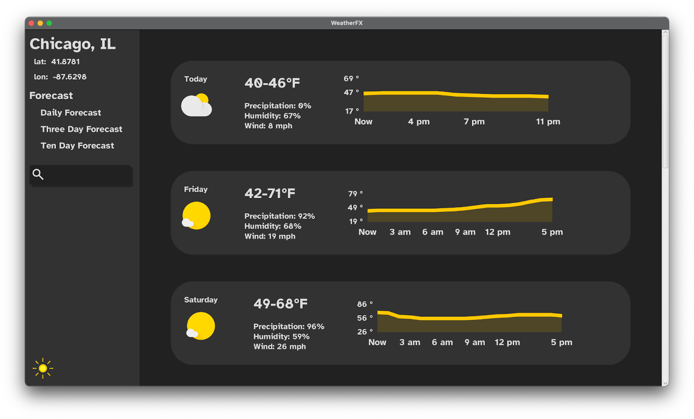

### Another Weather App
Slick little weather app for CS 342: Software Design

Including neat-o features like:
- Searching for US Cities!
    - Navigate through results with arrow keys or (if you're cool) `Ctrl-j` `Ctrl-k`.
- Input a specific Latitude and Longitude 
- Charts for Temperature and Humidity
- Dynamic widgets for wind direction, air pressure, dew point, oh my!
- Unit changes!
- Daily, Three day, and a Ten day forecast!
- Light, dark, and a (sssh) secret Kanagawa Theme based on the popular [editor theme](https://github.com/rebelot/kanagawa.nvim)

Check out these screen shots:

